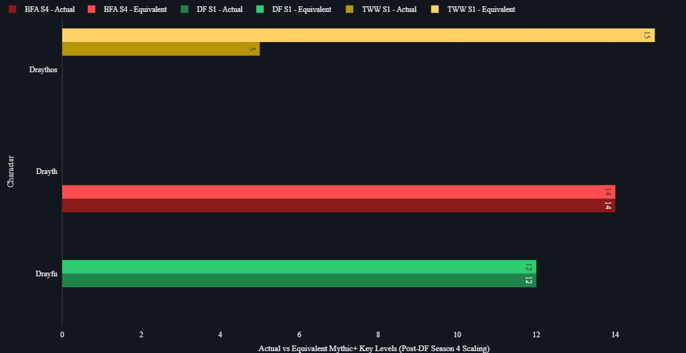

# WoW Mythic+ Data Pipeline

## Overview

This project is a **personal data engineering portfolio project** focused on building an end-to-end data pipeline using real-world data.

The pipeline ingests **World of Warcraft Mythic+ dungeon data** from the Raider.IO API and processes it through a **Medallion Architecture (Bronze → Silver → Gold)** using PySpark in Databricks.

The goal of this project is to demonstrate the **full lifecycle of a modern data pipeline**, including ingestion, transformation, modeling, and analytics preparation.

## Example Visualization 

This visualization highlights how Mythic+ difficulty scaling changed across expansions.

To allow fair comparisons:
- Older seasons (Battle for Azeroth Season 4, Dragonflight Season 1) use original key levels
- Newer seasons (The War Within Season 1) are adjusted by +10 levels

This allows direct comparison of player performance across different game systems.

---

## Project Goals

- Ingest data from an external API
- Work with deeply nested JSON data
- Transform and normalize data using PySpark
- Design analytics-ready datasets
- Implement Medallion Architecture
- Organize and version control a data project using GitHub

---

## Data Source

Data is pulled from the **Raider.IO API**, which provides detailed statistics about Mythic+ dungeon runs.

The API returns **deeply nested JSON**, making it ideal for practicing:

- JSON parsing
- Data normalization
- Exploding nested arrays
- Schema design

The pipeline currently collects data for:

- Drayfu
- Drayth
- Draythos

---

## Architecture

This project follows the **Medallion Architecture pattern**, commonly used in modern data platforms.

---

### Bronze Layer — Raw Data

The Bronze layer stores **raw API responses with no transformations**.

**Purpose:**
- Preserve original source data
- Enable reprocessing if logic changes
- Maintain a single source of truth

**What it does:**
- Reads JSON files from Databricks Volume storage
- Writes raw data into a Delta table

**Output Table:**
- `workspace.bronze_mythic_plus_runs.mythic_runs_bronze`

---

### Silver Layer — Cleaned & Structured

The Silver layer transforms raw JSON into structured datasets.

**Key Transformations:**
- Flattening nested JSON structures
- Exploding arrays (players, boss encounters)
- Cleaning character names (removing suffixes)
- Standardizing role values (Tank, Healer, DPS)
- Converting timestamps to proper formats
- Normalizing season names

**Output Tables:**
- `workspace.silver_mythic_plus.dungeons`
- `workspace.silver_mythic_plus.players`
- `workspace.silver_mythic_plus.boss_encounters`

---

### Gold Layer — Analytics Ready

The Gold layer organizes data into **fact and dimension tables** for analysis.

#### Fact Tables

**`fact_mythic_runs`**  
One row per player per dungeon run.

Columns include:
- keystone_run_id
- character_name
- class
- spec
- role
- dungeon_id
- dungeon_name
- keystone_level
- clear_time_ms
- completed_at
- score
- season

---

**`fact_boss_encounters`**  
One row per boss encounter within a run.

Columns include:
- keystone_run_id
- encounter_id
- boss_name
- fight_duration_ms
- boss_killed
- dungeon_id
- keystone_level
- completed_at

---

#### Dimension Tables

**`dim_characters`**
- character_name
- class
- spec
- role
- realm
- region

**`dim_dungeons`**
- dungeon_id
- dungeon_name
- expansion_id
- timer_ms

**`dim_bosses`**
- encounter_id
- boss_name

---

### Data Modeling Notes

Some descriptive fields (such as class, spec, and role) are currently included in the fact table for simplicity.

In a production environment, these would be fully normalized into dimension tables to create a more traditional **star schema**.

---

## Visualization Layer

A separate notebook is used to analyze the Gold data and prepare datasets for visualization.

### Current Analysis

**Character Performance Summary**
- Total runs
- Highest key completed
- Best score
- Average score

**Best Run per Season**
- Calculates a normalized “equivalent key” value
- Accounts for Mythic+ scaling changes across expansions
- Identifies the best run per character per season

> Note: Some light transformation (season normalization logic) is performed in the visualization notebook. In a production pipeline, this logic would be moved into the Gold layer.

---

## Repository Structure
wow-mythic-data-pipeline/
│
├── ingestion/
│ └── raiderio_api_ingest.py
│
├── bronze/
│ └── bronze_layer_ingestion.ipynb
│
├── silver/
│ └── silver_layer_transformation.ipynb
│
├── gold/
│ └── gold_layer_modeling.ipynb
│
├── analysis/
│ └── mythic_plus_visualizations.ipynb
│
├── data/
│ └── sample_json/
│
├── docs/
│ └── (screenshots, diagrams)
│
├── README.md
└── .gitignore

---

## Example Data Flow

1. **Ingestion**
   - Pull Mythic+ run data from Raider.IO API
   - Store raw JSON files

2. **Bronze**
   - Load JSON into Delta table with no changes

3. **Silver**
   - Flatten nested data
   - Extract players, dungeons, and encounters
   - Clean and standardize fields

4. **Gold**
   - Join datasets
   - Create fact and dimension tables
   - Prepare data for analytics

5. **Analysis**
   - Aggregate character performance
   - Compare seasonal progression
   - Prepare visualization datasets

---

## Current Status

### Completed

- API ingestion from Raider.IO
- Bronze layer raw data storage
- Silver layer transformations (players, dungeons, encounters)
- Gold layer fact and dimension modeling
- Initial visualization and analysis

### In Progress

- Refactoring notebooks into production-style pipelines
- Improving documentation and structure
- Adding data quality checks
- Expanding analytics use cases

---

## Next Steps

Planned improvements:

- Add data quality validation checks
- Normalize Gold layer into a full star schema
- Build additional analytics tables (leaderboards, best runs)
- Create dashboards (Power BI / Tableau)
- Automate pipeline execution

---

## Technologies Used

- Databricks
- PySpark
- Delta Lake
- Python
- Git / GitHub

---

## Author

Amanda Berry  
Systems Analyst → Data Engineering
